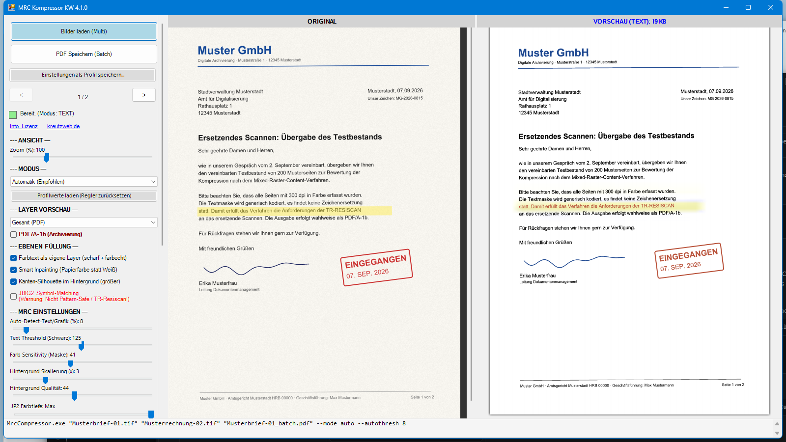

# MRC PDF Kompressor — gescannte Dokumente in winzige, scharfe PDFs (Windows)

Ein kostenloses Windows-Programm, das gescannte Seiten (TIFF, JPEG, PNG) mit
**Mixed Raster Content (MRC)** in extrem kompakte PDF-Dateien verwandelt —
typisch **90–95 % kleiner** als der Original-Scan, bei gestochen scharfem Text.
Standardmäßig pattern-safe (keine JBIG2-Zeichenersetzung), damit geeignet für
das ersetzende Scannen nach **BSI TR-RESISCAN**.

**Webseite & Download:** https://kreutzweb.de/tool-mrc-pdf-kompressor.html



## Warum

Eine farbige A4-Seite mit 300 DPI ist als TIFF 25 MB groß und als JPEG immer
noch mehrere MB. Archive, DMS und Postfächer laufen damit schnell voll.
Kommerzielle MRC-Engines lösen das, werden aber pro Arbeitsplatz oder
Seitenvolumen lizenziert. Dieses Werkzeug liefert vergleichbare Ergebnisse —
in unseren Benchmarks kleinere Dateien als führende kommerzielle MRC-Produkte
bei gleicher Lesbarkeit — und ist für Privatpersonen und kleine Unternehmen
kostenlos.

## Funktionen

- **Extreme Kompression**: aus einem 5-MB-Scan werden im Text-Modus deutlich
  unter 100 KB
- **Pattern-safe / TR-RESISCAN**: generische JBIG2-Kodierung ohne
  Zeichenersetzung — kein Zeichen wird durch ein „ähnliches" ersetzt (die
  bekannte JBIG2-Falle); optionaler Symbol-Modus für maximale Kompression,
  wenn keine Revisionssicherheit nötig ist
- **Farbtext-Ebenen**: farbige Überschriften, Stempel, Logos und Textmarker
  werden automatisch erkannt und als eigene scharfe 300-DPI-Ebenen in
  Originalfarbe erhalten (bis zu 4 Farbcluster je Seite)
- **Smart Inpainting & Background Bleaching**: der Hintergrund hinter dem Text
  wird mit der echten Papierfarbe rekonstruiert, Grauschleier und
  Durchscheinen entfernt — keine Halos, kleinere Dateien
- **PDF/A-1b** für die Langzeitarchivierung (ISO 19005-1)
- **Mehrseitige TIFFs**, Ordner und Wildcards als Eingabe, parallele
  Seitenverarbeitung auf Mehrkern-CPUs
- **Split-View-Oberfläche** mit Echtzeit-Vorschau (Original vs. Ergebnis),
  synchronem Zoom, Ebenen-Ansicht, Profilen („Text", „Grafik", …) und einer
  generierten Kommandozeile zum Übernehmen in Skripte
- **Voll skriptbare CLI**: Exit-Codes 0/1/2, Fortschritt je Seite, `--help`,
  jeder Profilwert überschreibbar

## Wie es funktioniert

1. **Text-Maske** — schwarzer Text wird in voller Auflösung (300 DPI)
   extrahiert und als JBIG2 kodiert (generische Region, pattern-safe;
   CCITT G4 als Rückfallebene)
2. **Farbtext-Ebenen** — farbige Schrift, Stempel und Logos werden nach Farbe
   gruppiert und als eigene Stencil-Ebenen eingebettet
3. **Hintergrund** — Papierstruktur und Fotos werden inpainted, geglättet,
   verkleinert und als JPEG 2000 oder JPEG kodiert

Im PDF liegen diese Ebenen deckungsgleich übereinander: ein Bruchteil der
Originalgröße bei voller Lesbarkeit.

## Download & Installation

Ein ZIP (ca. 31 MB) über die Webseite. In einen beliebigen Ordner entpacken
und `MrcCompressor.exe` starten — kein Installer, nichts wird tief ins System
geschrieben. `MrcCompressor.exe` ist digital signiert (Certum-Zertifikat auf
Daniel Kreutz); SHA256-Prüfsumme und unabhängige VirusTotal-Berichte stehen
auf der Download-Seite.

Voraussetzungen: Windows 10/11 64-Bit, .NET Framework 4.8,
[Visual C++ Redistributable x64](https://aka.ms/vc14/vc_redist.x64.exe).

## Kommandozeile

```
MrcCompressor.exe "Scan01.tif" "Archiv01.pdf" --mode text --pdfa
MrcCompressor.exe C:\Scans\*.tif Stapel.pdf --mode auto
MrcCompressor.exe --help
```

| Option | Bedeutung |
|---|---|
| `--mode auto\|text\|image\|text2\|image2` | Verarbeitungsstrategie (Automatik erkennt Text- vs. Grafikseiten) |
| `--pdfa` | PDF/A-1b-Ausgabe |
| `--threshold 0-255` | Empfindlichkeit der Texterkennung |
| `--scale 1-10` | Verkleinerungsfaktor des Hintergrunds (stärkster Größenhebel) |
| `--quality 0-100` | Qualität des Hintergrunds (JPEG 2000 / JPEG) |
| `--jbig2symbols` | JBIG2-Symbol-Matching (max. Kompression, **nicht** pattern-safe) |
| `--dpi N` | Auflösung für Bilder ohne DPI-Angabe erzwingen |

Jeder Modus startet mit seinem Profil aus `mrc_profiles.xml`; angegebene
Parameter überschreiben das Profil. Exit-Codes: 0 = ok, 1 = Fehler / keine
Seite, 2 = Bedienfehler. Die vollständige Parameter-Referenz steht auf der
Webseite.

## Lizenz

**PolyForm Small Business License 1.0.0**: kostenlos für Privatpersonen und
Organisationen mit weniger als 100 Personen **und** unter 1 Mio. USD
Jahresumsatz — größere Unternehmen benötigen eine kostenpflichtige Lizenz über
[kreutzweb.de](https://kreutzweb.de). Aufgebaut auf hervorragender
Open-Source-Software: ImageMagick (Magick.NET), SkiaSharp, iTextSharp LGPL,
jbig2enc + Leptonica, potrace (GPL, Quellcode liegt bei), PDFium, Bouncy
Castle — siehe THIRD-PARTY-NOTICES.txt im Paket.
